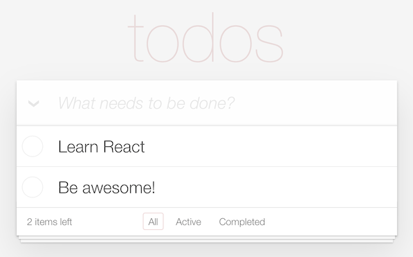
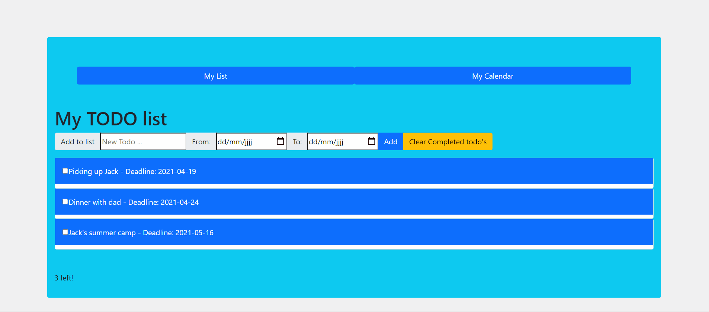

# React Basics

- Repository: `react-basics`
- Mode: `solo`
- Type of Challenge: `learning`
- Duration: `4 days`
- Deployment: `Netlify`

## Learning Objectives

There are many frameworks for many situations. Back-end frameworks like Laravel, Django or Express will make the lives of back-end developers a lot easier, for example. This is also the case for front-end frameworks and developers. Today we will dive into one of those amazing frameworks that could make a front-end developer's live easier!

At the end of this 4-days challenge you will:

- Be able to create a new React application
- Be able to "think in React"
- Be able to use basic hooks for managing state and reactivity
- Be able to organize your app in components

## Your mission

This time the task is simple: you will build a small todo application that lives in your browser, and saves todos even after restarting the browser.

## 🌱 Must-have's

- Read this documentation on [the basics](0.The-Basics/README.md)
- Create a React application and run it locally on your browser (hint-hint: [start here](1.Getting-Started/README.md))
- Publish the source code on your GitHub repository
- Build a todo app with React.js
- Save your todos, even after starting the browser again
- Deploy the project on a live server

  _Tip if you choose Netlify: to deploy a React app you first run the command `npm run build`, and once the command finishes you will have your app ready in the `build` folder: just drag and drop this folder in Netlify and you are done. Easy!_

## 🌼 Nice-to-have (doable)

- Refactor parts you aren't happy with.
- Rebuild from scratch without any tutorial to improve your understanding the instructions will be of a big help here!).
- Improve on your project so that it's not only a learning repository, but also a showcase project when interviewing:
- Add styling
- Improve responsiveness
- Check for little, smooth effects
- Think UX: what extra features can make your todo app better?

## 🌳 Nice-to-have (hard)

Done with all the above? Don't worry! We have some more you can do:

- Install a React package of a calendar and implement it in a new component into your App.
- Install and use React-router-dom as a router between components. _(Hint: Think about a structure like: router -> show component)_
  
- See if someone else needs help.
- Have a live edit option for existing todos (when you click on the text of a todo, the app allows you to edit it in place).
- Make a version with another JS framework like VueJS or Svelte.

## Good luck!

